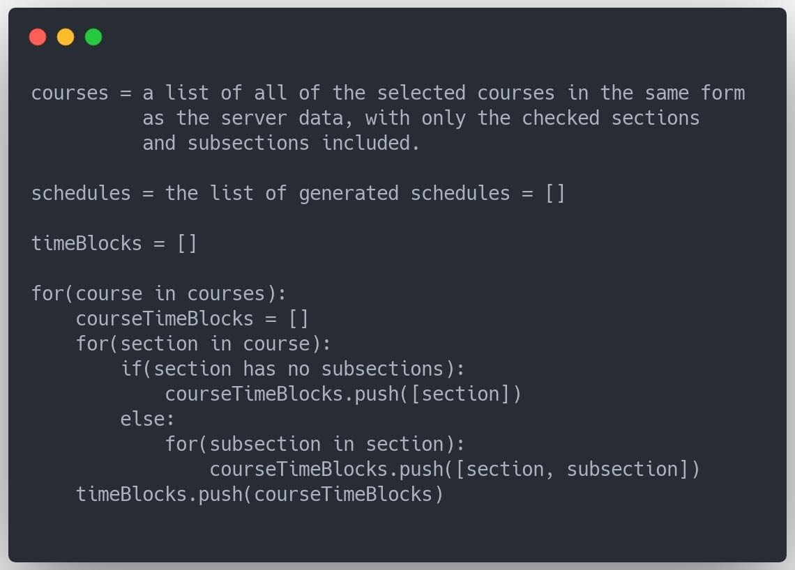

# Assignment: React 3 (6 Points Total)

This assignment is meant to introduce you to more features of React. This project is the third of a four part React project in which you will build a course scheduling application. This application uses a limited quantity of modified data from the UW Madison course information database.

With this assignment, you have two options for the project you build. Option 1 is a recommender system and Option 2 is a planner system.

## Course data

The course data is being fetched from `https://mysqlcs639.cs.wisc.edu:5000/classes/` and is formatted as follows:

```
{
  <alpha-numeric key of length 3>: {
    "credits": <number of credits for the course>,
    "description": <course description>,
    "keywords": <1D list of string keywords>,
    "name": <course name>,
    "number": <course number>,
    "requisites": <2D list of course requisites>,
    "sections": {
      <section number>: {
        "instructor": <instructor name>,
        "location": <section location>,
        "subsections": {
          <subsection number>: {
            "location": <subsection location>,
            "time": {
              <weekday>: <time range>, ...
            }
          }, ...
        },
        "time": {
          <weekday>: <time range>, ...
        }
      }, ...
    },
    "subject": <course subject>
  }
}
```

- The list of course requisites consists of 1D lists with AND operations between them. Each 1D list has OR operations between elements. For example: `[[A, B], [C, D, E], [F]]` means that the requisites are `(A OR B) AND (C OR D OR E) AND (F)`. The requisites will be represented as the course's alpha-numeric key used in the outermost object.
- A course can have any number of sections, and each section can have any number of subsections. If the course contains subsections, the user must schedule exactly one subsection with its parent section.
- Sections and subsections can have any number of times. Each time's key is a weekday in all lowercase ("monday", "tuesday", "wednesday", ...). Each time's value is a string with the following format: `"<12 hour time><am or pm> - <12 hour time><am or pm>"`. An example of this would be `"11:45am - 12:35pm"`.
- Each course has exactly one subject

```
Your project must be able to accept any data with the same format as above and the data located at https://mysqlcs639.cs.wisc.edu:5000/classes/
```

# Recommender

## Problem 1 (1.25 points)

- Fetch data from server `https://mysqlcs639.cs.wisc.edu/students/5022025924/classes/completed`
- Create a new component to represent previously taken courses. This component might look somewhat like the Course component, but it will be simpler and won’t have options to add the course to the cart.
- Create a new component to hold the previously taken courses. Make this component accessible from the app.
  
## Problem 2 (1.25 points)

- Create a component for rating a specific course.
- Allow the user to rate courses they have already taken.

## Problem 3 (1.25 points)

- Generate a list of interest areas based on the course data (maybe look at subjects and keywords)
- Create a component for the user to select interest areas as defined in step 1.
- Make this component available to the user.

## Problem 4 (1.25 points)

- Create the recommender algorithm that takes in the rated courses and interest areas. Search through subjects and keywords to find the courses most similar to the highly rated courses and the courses that match the most interest areas
- Display the recommended courses to the user. (Maybe show a few recommended courses or sort all courses by their recommendation score)

## General (1 point)

- Projects will be graded on the general usability and design of the system. You should consider the way the users navigate around the application, and other concepts covered in design lecture.

---

# Planner

## Problem 1 (2 points)

- Create a new planner view
- Create a sidebar component for this planner view that displays all of the courses, sections, and subsections in the cart with with a way for the user to select each one
- Store the data of what is selected to make the selections related (if a course is selected, all of its sections and subsections will also be selected)

## Problem 2 (1 point)

- Create a function to generate all of the possible schedules based on the data from planner's sidebar

## Problem 3 (2 points)

- With the provided component, create a schedule component that displays a generated schedule
- Create a way for the user to view all generated schedules

## Pseudocode for schedule generation


- Now, timeBlocks contains a list for each course in which one of the section-subsection pairs must be selected to schedule. Iterate through all of these possibilities and add to schedules if there are no conflicts

## General (1 point)
- Projects will be graded on the general usability and design of the system. You should consider the way the users navigate around the application, and other concepts covered in design lecture.

---

## Styling and npm packages

You are allowed and encouraged to use [react-bootstrap](https://react-bootstrap.github.io/) for styling, and it is already installed in the React project for your use. You may alternatively use [Bootstrap](https://getbootstrap.com/) or CSS for stlying if desired.

If you would like to use additional npm packages, ask one of the TAs or Peer Mentors for permission.

You will be graded on the content you display and the style in which you display it, as well as your code quality.

---

**Run `npm install` in the terminal after cloning to automatically install needed npm packages such as react-bootstrap**

This project was bootstrapped with [Create React App](https://github.com/facebook/create-react-app).

## Available Scripts

In the project directory, you can run:

### `npm start`

Runs the app in the development mode.<br>
Open [http://localhost:3000](http://localhost:3000) to view it in the browser.

The page will reload if you make edits.<br>
You will also see any lint errors in the console.
